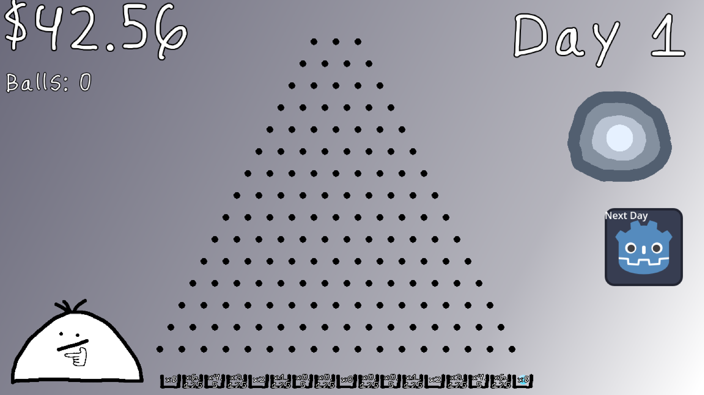

# Bets and Regrets 🎲
***
You've lived a **bad** life, and now you're in the afterlife.
You want a second chance, so you made a deal with the *devil*.
You need to get 10 million dollars. You can get it by working for ***hundreds of years***, or you could gamble it all for a chance to win **BIG**.
Luckily, you have *$5.32* from your wallet when you died. That's more than enough to gamble! 
And besides, most gamblers quit before they win big, so naturally, you won't quit, right? But be careful when you're gambling! 
If you lose too much, you'll be the devil's indentured servant...

## Gameplay 🎮
Every day, you can play Plinko once to try and get some money, just drop a ball or two and see where it leads you! Each day you play, you get an extra ball. For example, on day 1 you would have one ball but on day 7 you would have 7 balls to use! When you're done with that day, press the next day button to progress in the story!

## Installation / How to play 🔧
You have two options:
1. Go and play on [Itch.io!](https://kolin63.itch.io/bets-and-regrets)
2. Download the source code, open it in Godot 4, and compile it in whatever format you wish!

***
## About Us (Haac)

#### Ayan Bindal - The Storyteller ([@3XAY](https://github.com/3XAY)) 👨‍💻
Ayan B. was the vision behind this game. With the help of the rest of the team, he was able to come up with ideas
that would provide the game with a greater sense of depth. He was also the project lead, making sure everyone
was able to do their job and was taking adequate breaks, along with ensuring the storyline was properly translated into
the actual experience. He also recorded the voicelines for The Devil, and provided the handmade font used throughout the game.
He is a 15 (almost 16) year old programmer who has been coding for over 7 years now. He mainly knows Python and Java, 
but uses Scratch, Circuitpython, Micropython, and Javascript from time to time. He specializes in computers and servers,
but enjoys tinkering with tech overall. 
He documents his journey on his [Youtube channel](https://www.youtube.com/@3XAY/) and his [website](https://3xay.github.io/).

#### Colin Melican - The Programmer ([@Kolin63](https://github.com/Kolin63)) 💻
Colin was the programmer in this team. He brought all of the pieces together and made our vision into a reality.
Through Godot, he was able to craft a fun to play and immersive experience.
He has been coding for a few years in Python, C#, Java, and C++. This (Counterspell) was his fourth game jam, and his second time
using Godot. If you want to see more of his work, he posts on his [Youtube channel](https://www.youtube.com/@kolindev/).

#### Ayan Desai - The Audio Engineer ([@AyanDesai-code](https://github.com/AyanDesai-code)) 🎵
Ayan D. was the man behind all of the audio in this game. He created 7 fully original soundtracks, each suited to fit a scene in the game.
He also edited the voiceovers to make them sound better. He is a fullstack developer who specializes in Java, Python, and web development
with the Bootstrap framework. Additionally, creates music and art for fun. Ayan D. enjoys making Youtube videos as well, so be sure to
check out his [channel](https://www.youtube.com/@master-tech-videos).

#### Hayden Lee - The Artist ([@Dadafruta](https://github.com/dadafruta)) 🖌️
Hayden was the artist in this group. He hand-drew every single visual element (other than the font) to make it perfectly
align with our vision for the game, and to help the story come to life. He was also the main voice actor, for both the intro
and the main character. He is a 16 year old programmer who mainly uses Python, and also uses some Javascript.
He primarily studies Medical at Bergen County Academies, so he programs on the side.
